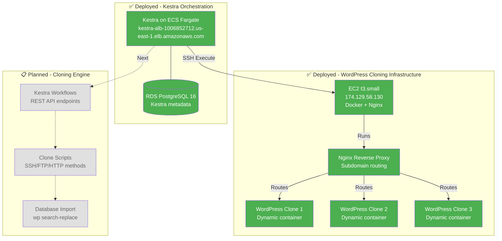
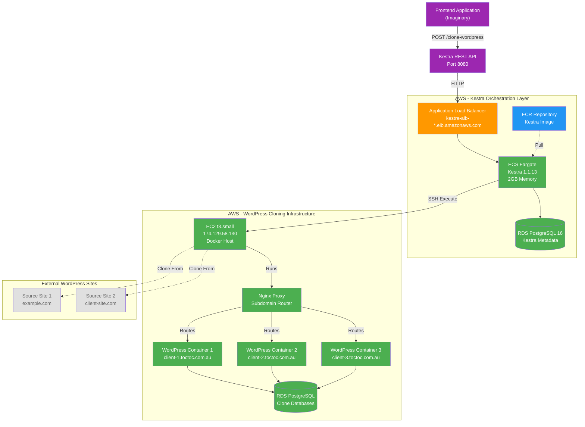

# WordPress Cloning Service

> Dynamic WordPress site cloning with Kestra orchestration, EC2 Docker hosting, and Nginx reverse proxy

## Overview

This system clones ANY external WordPress site to isolated Docker containers with custom subdomains (client-X.toctoc.com.au), orchestrated via Kestra REST API workflows.

## Current Status



### ✅ Phase 1: Kestra Orchestration (Complete)

**Kestra Instance:**
- 🌐 **URL:** http://kestra-alb-1006852712.us-east-1.elb.amazonaws.com/ui/
- 🚀 **Platform:** AWS ECS Fargate (2GB memory, 0.5 vCPU)
- 📦 **Plugins:** 912 plugins loaded
- 🗄️ **Database:** RDS PostgreSQL 16 (db.t3.micro, 20GB)
- 🔒 **Authentication:** Disabled (development mode)
- **Purpose:** Orchestrates WordPress cloning via REST API, triggers scripts on EC2 via SSH

**Infrastructure Components:**
- VPC with public/private subnets (shared with EC2)
- Application Load Balancer for HTTP access
- ECR repository for Docker images
- CloudWatch Logs for monitoring

**Deployment:**
- Infrastructure: Terraform (us-east-1)
- Deployed: 2026-01-14

### ✅ Phase A: EC2 WordPress Hosting (Complete)

**EC2 Instance:**
- 🖥️ **IP:** 174.129.58.130
- 💻 **Instance Type:** t3.small (2GB RAM, 2 vCPU)
- 🐳 **Docker:** 25.0.14 + Docker Compose v2.24.5
- 🌐 **Nginx:** 1.25.5 (reverse proxy for subdomain routing)
- 🔧 **Tools:** WP-CLI 2.12.0, AWS CLI 2.32.34, PHP 8.4.16
- **Purpose:** Hosts up to 3 WordPress clone containers with dynamic subdomain routing

**Container Architecture:**
- Nginx proxy container (always running)
- WordPress containers created on-demand during clone
- Each clone gets: dedicated container + Docker volume + Nginx vhost + subdomain
- Network: wordpress-cloning-network (bridge)

**Management Scripts:**
- `create-wordpress-container.sh` - Create container + Nginx config
- `delete-wordpress-container.sh` - Remove container + cleanup
- `list-wordpress-containers.sh` - Show all clones

**Deployment:**
- Infrastructure: Terraform (terraform/ec2/)
- SSH Key: wordpress-cloning-key.pem
- Deployed: 2026-01-14

### 📋 Phase B: WordPress Cloning Engine (In Progress)

**Multi-Method Cloning:**
- Method 1: SSH + wp-cli (fastest, ~2 min for 500MB)
- Method 2: FTP/SFTP + mysqldump (common hosting)
- Method 3: HTTP + WP REST API (fallback)
- Method 4: Web scraping (last resort)
- Automatic fallback if primary method fails

**Database Handling:**
- Export source WordPress database
- Create new RDS PostgreSQL database per clone
- Import and run wp search-replace for URL updates
- Preserve plugins, themes, and media

**Dynamic Provisioning:**
- Generate unique subdomain (client-X.toctoc.com.au)
- Create Docker container with fresh WordPress
- Generate Nginx vhost configuration
- Reload Nginx without downtime

### 📋 Phase C: Kestra Workflow Integration (Planned)

**REST API Endpoints (via Kestra):**
- `POST /api/executions/wordpress.cloning/clone-create` - Clone WordPress site
- `GET /api/executions/wordpress.cloning/clone-list` - List all clones
- `DELETE /api/executions/wordpress.cloning/clone-delete` - Remove clone
- `GET /api/executions/{id}` - Poll execution status

**Workflow Logic:**
1. Frontend calls Kestra REST API
2. Kestra SSH to EC2 instance
3. Execute clone scripts with parameters
4. Monitor progress and capture output
5. Return clone URL (https://client-X.toctoc.com.au)

## Architecture



## Tech Stack

**Orchestration Layer (Deployed):**
- **Kestra 1.1.13** - Workflow orchestration, REST API exposure
- **AWS ECS Fargate** - Serverless Kestra hosting
- **AWS RDS PostgreSQL 16** - Kestra metadata storage
- **AWS ALB** - Public HTTP access to Kestra
- **AWS ECR** - Custom Kestra Docker image
- **Terraform** - Infrastructure as code

**WordPress Hosting Layer (Deployed):**
- **EC2 t3.small** - Docker host for WordPress clones
- **Docker 25.0.14** - Container runtime
- **Docker Compose v2.24.5** - Multi-container orchestration
- **Nginx 1.25.5** - Reverse proxy for subdomain routing
- **WordPress 6.4** - Official Docker image (pulled on-demand)
- **WP-CLI 2.12.0** - WordPress command-line tool
- **PHP 8.4.16** - Required by WP-CLI
- **AWS CLI 2.32.34** - AWS service integration
- **MariaDB 10.5** - MySQL client for database operations

**Cloning Engine (In Progress):**
- **Bash Scripts** - Clone orchestration logic
- **wp search-replace** - URL replacement in databases
- **SSH/FTP/HTTP** - Multi-method site access
- **Dynamic Nginx config generation** - Automatic vhost creation

## Project Structure

```
copy-wordpress/
├── terraform/
│   ├── aws/                    # ✅ Kestra infrastructure
│   │   ├── vpc.tf, ecs.tf, alb.tf, rds.tf, etc.
│   │   └── terraform.tfvars
│   └── ec2/                    # ✅ WordPress hosting infrastructure
│       ├── main.tf             # EC2, security groups, IAM
│       ├── variables.tf, outputs.tf
│       └── terraform.tfvars
├── docker/
│   └── Dockerfile.kestra       # ✅ Custom Kestra image
├── kestra/
│   ├── config/
│   │   └── application-aws.yaml # ✅ Kestra configuration
│   └── flows/                  # 📋 Workflow definitions (planned)
├── docker-compose.yml          # ✅ Nginx proxy base config
├── .env.example                # ✅ Environment variables template
├── nginx/
│   ├── nginx.conf              # ✅ Nginx base configuration
│   └── conf.d/
│       └── default.conf        # ✅ Catch-all vhost
├── scripts/
│   ├── deploy_kestra_aws.sh    # ✅ Kestra deployment
│   ├── destroy_kestra_aws.sh   # ✅ Kestra teardown
│   ├── setup-ec2.sh            # ✅ EC2 initial setup
│   ├── create-wordpress-container.sh # ✅ Create clone
│   ├── delete-wordpress-container.sh # ✅ Remove clone
│   └── list-wordpress-containers.sh  # ✅ List clones
├── openspec/
│   └── changes/
│       ├── add-aws-kestra-deployment/     # ✅ Complete
│       └── add-wordpress-cloning-service/ # 🔄 In Progress
│           ├── proposal.md
│           ├── design.md
│           ├── tasks.md
│           └── specs/
└── wordpress-cloning-key.pem   # ✅ EC2 SSH key
```

## Quick Start

### Access Deployed Infrastructure

**Kestra UI:**
```
http://kestra-alb-1006852712.us-east-1.elb.amazonaws.com/ui/
```

**EC2 Instance (SSH):**
```bash
ssh -i wordpress-cloning-key.pem ec2-user@174.129.58.130
```

**Test Nginx:**
```bash
curl -I http://174.129.58.130
# Should return: HTTP/1.1 404 (no clones yet)
```

### Prerequisites

- AWS CLI v2 configured with us-east-1 region
- Terraform >= 1.14.3
- Docker installed
- SSH key: wordpress-cloning-key.pem


## Development

This project uses [OpenSpec](https://github.com/cased/openspec) for change management.

**Completed Proposals:**
- ✅ `add-aws-kestra-deployment` - Kestra on ECS Fargate with RDS PostgreSQL
- 🔄 `add-wordpress-cloning-service` - Phase A complete (EC2 infrastructure)

**In Progress:**
- 🔄 Phase B: WordPress cloning engine (multi-method clone scripts)
- 📋 Phase C: Kestra workflow integration (REST API endpoints)

## Security Notes

**Kestra:**
- ⚠️ Authentication disabled (development mode)
- 🔒 RDS password in AWS Secrets Manager
- 🔐 ECS tasks use IAM roles
- 🌐 Public HTTP access (no SSL)

**EC2 WordPress Host:**
- 🔑 SSH key-based authentication only
- 🔒 Security group: ports 22, 80, 443 allowed
- 🔐 IAM instance profile for AWS Secrets Manager access
- ⚠️ HTTP only (SSL planned for subdomains)


---

## How It Works

1. **Frontend calls Kestra REST API** with source WordPress URL
2. **Kestra triggers SSH command** on EC2 instance
3. **Clone script executes** on EC2:
   - Detects best clone method (SSH/FTP/HTTP)
   - Downloads WordPress files and database
   - Creates new Docker container
   - Imports database to RDS
   - Runs wp search-replace for URL updates
   - Generates Nginx vhost config
   - Reloads Nginx
4. **Returns clone URL** to frontend (e.g., client-1.toctoc.com.au)

---

**Last Updated:** 2026-01-14  
**Status:** Phase A Complete (Infrastructure) | Phase B In Progress (Cloning Engine)
