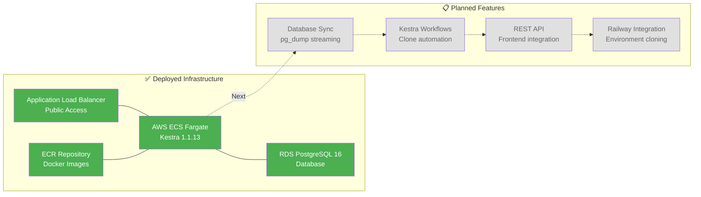
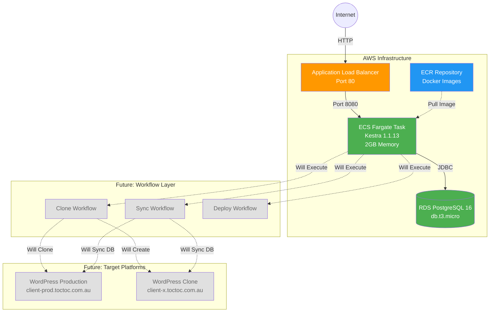

# WordPress Staging Automation

> Fast PostgreSQL database synchronization and environment cloning system powered by Kestra

## Overview

This system automates WordPress staging environment provisioning using Kestra workflow orchestration, PostgreSQL streaming replication, and infrastructure-as-code.

## Current Status



### ✅ Phase 1: Infrastructure (Complete)

**Kestra Instance:**
- 🌐 **URL:** http://kestra-alb-1006852712.us-east-1.elb.amazonaws.com/ui/
- 🚀 **Platform:** AWS ECS Fargate (2GB memory, 0.5 vCPU)
- 📦 **Plugins:** 912 plugins from 164 groups loaded
- 🗄️ **Database:** RDS PostgreSQL 16 (db.t3.micro, 20GB)
- 🔒 **Authentication:** Disabled (development mode)

**Infrastructure Components:**
- VPC with public/private subnets across 2 AZs
- Application Load Balancer for HTTP access
- ECR repository for Docker images
- CloudWatch Logs for monitoring
- Secrets Manager for credentials

**Deployment:**
- Infrastructure: Terraform (local state)
- Region: us-east-1
- Deployed: 2026-01-14

### 📋 Phase 2: Database Sync (Planned)

**Fast PostgreSQL Streaming for WordPress:**
- Sub-30-second WordPress database cloning using `pg_dump | psql`
- Zero disk I/O (Unix pipe streaming)
- Support for 1GB+ WordPress databases
- Automatic rollback on failure
- Preserve WordPress URLs and site-specific configurations

### 📋 Phase 3: Workflow Automation (Planned)

**Kestra Workflows:**
- Clone WordPress environments with custom client domains (e.g., client-x.toctoc.com.au)
- Database synchronization between environments
- Environment management (list, delete, restart)
- Automated health checks and monitoring

### 📋 Phase 4: Frontend Integration (Planned)

**REST API Access:**
- Webhook-triggered cloning
- Real-time execution polling
- Status updates and error handling
- Frontend dashboard integration

## Architecture



## Tech Stack

**Deployed:**
- **Kestra** - Workflow orchestration platform
- **PostgreSQL** - Database (RDS managed)
- **Terraform** - Infrastructure as code
- **AWS ECS Fargate** - Serverless container platform
- **Docker** - Container packaging
- **AWS RDS** - Managed PostgreSQL
- **AWS ALB** - Load balancing
- **AWS ECR** - Container registry

**Planned:**
- **Bash** - WordPress cloning automation scripts
- **DNS Management** - Custom domain routing (e.g., client-x.toctoc.com.au)
- **pg_dump/psql** - Database replication between environments
- **jq** - JSON parsing for configuration management

## Project Structure

```
copy-wordpress/
├── terraform/aws/          # ✅ AWS infrastructure (Terraform)
│   ├── provider.tf         # AWS provider configuration
│   ├── variables.tf        # Input variables
│   ├── vpc.tf              # VPC and networking
│   ├── security_groups.tf  # Security groups
│   ├── iam.tf              # IAM roles
│   ├── rds.tf              # PostgreSQL database
│   ├── ecs.tf              # ECS cluster and tasks
│   ├── alb.tf              # Application load balancer
│   ├── ecr.tf              # Container registry
│   ├── outputs.tf          # Infrastructure outputs
│   └── terraform.tfvars    # Configuration values
├── docker/                 # ✅ Docker configuration
│   └── Dockerfile.kestra   # Custom Kestra image
├── kestra/config/          # ✅ Kestra configuration
│   └── application-aws.yaml # AWS-specific config
├── scripts/                # ✅ Deployment scripts
│   ├── deploy_kestra_aws.sh    # Full deployment
│   └── destroy_kestra_aws.sh   # Infrastructure teardown
├── openspec/               # 📋 Change proposals
│   └── changes/
│       └── add-aws-kestra-deployment/  # ✅ Complete
└── .gitignore
```

## Quick Start

### Prerequisites

- AWS CLI v2 configured
- Terraform >= 1.14.3
- Docker installed
- AWS account with appropriate permissions


# Access Kestra UI
# http://kestra-alb-1006852712.us-east-1.elb.amazonaws.com/ui/
```


## Development

This project uses [OpenSpec](https://github.com/cased/openspec) for change management.

**Completed Proposals:**
- ✅ `add-aws-kestra-deployment` - AWS infrastructure with ECS Fargate and RDS

**Planned Proposals:**
- 📋 Database sync with pg_dump streaming
- 📋 Kestra workflow automation
- 📋 REST API frontend integration

## Security Notes

- ⚠️ Authentication currently disabled (development mode)
- 🔒 RDS password stored in AWS Secrets Manager
- 🔐 ECS tasks use IAM roles for AWS access
- 🌐 ALB provides public HTTP access (no SSL yet)


---

**Last Updated:** 2026-01-14  
**Status:** Phase 1 Complete - Infrastructure deployed and operational
