# WordPress Staging Clone Automation

> Fast, automated WordPress staging environment cloning using Railway, Kestra, and PostgreSQL streaming

## Overview

This system provides **sub-30-second staging environment provisioning** for WordPress sites hosted on Railway. It uses imperative shell scripts, PostgreSQL streaming replication, and Kestra's REST API to enable frontend-triggered cloning operations.

### Key Features

- ⚡ **Lightning Fast**: Clone 1GB database + environment in <30 seconds
- 🔄 **Zero Disk I/O**: Stream database via Unix pipes (`pg_dump | psql`)
- 🌐 **REST API**: Frontend-triggered via Kestra webhooks
- 🔒 **Automatic Rollback**: Failed operations clean up automatically
- 📊 **Real-time Status**: Poll execution progress via Kestra API
- 🎯 **One Command**: Single script orchestrates entire clone process

## Architecture

```mermaid
graph TB
    subgraph "Frontend Application"
        A[React/Vue Dashboard]
        B[Clone Button]
        C[Status Polling Component]
    end
    
    subgraph "Kestra REST API"
        D[HTTP Webhook Trigger]
        E[Input Validation Task]
        F[Execute Clone Workflow]
        G[Output Formatting]
    end
    
    subgraph "Core Cloning Logic"
        H[clone_to_staging.sh]
        I[Railway CLI]
        J[pg_dump | psql]
        K[Domain Assignment]
    end
    
    subgraph "Railway Platform"
        L[Production Environment]
        M[Staging Environment]
        N[PostgreSQL Databases]
        O[Domain Routing]
    end
    
    A -->|User clicks clone| B
    B -->|POST /webhook/clone| D
    D -->|Validate inputs| E
    E -->|Trigger workflow| F
    F -->|Execute bash script| H
    H -->|Create environment| I
    H -->|Stream database| J
    H -->|Assign domain| K
    I -->|Duplicate environment| L
    I -->|Create new environment| M
    J -->|Copy data| N
    K -->|Generate URL| O
    F -->|Return execution ID| G
    G -->|202 Accepted| C
    C -->|Poll GET /executions/{id}| F
    F -->|State: SUCCESS| C
    C -->|Display staging URL| A
    
    style A fill:#e1f5ff
    style D fill:#fff4e6
    style H fill:#e8f5e9
    style M fill:#f3e5f5
```

## System Flow

```mermaid
sequenceDiagram
    participant FE as Frontend Dashboard
    participant KA as Kestra API
    participant KW as Kestra Workflow
    participant BS as Bash Script
    participant RC as Railway CLI
    participant RP as Railway Platform
    
    FE->>KA: POST /webhook/clone<br/>{client_name: "alpha"}
    KA->>KW: Create execution
    KA-->>FE: 202 Accepted<br/>{executionId: "01HQ..."}
    
    KW->>KW: Validate inputs
    KW->>KW: Generate env name
    KW->>BS: Execute clone_to_staging.sh
    
    BS->>RC: railway environment new<br/>--duplicate production
    RC->>RP: Create environment
    RP-->>RC: Environment created
    RC-->>BS: Success
    
    BS->>RC: railway variables --json
    RC-->>BS: DATABASE_URL (prod & staging)
    
    BS->>BS: pg_dump $PROD_URL | psql $STAGING_URL
    Note over BS: Streams 1GB in ~25s<br/>(no disk writes)
    
    BS->>RC: railway domain --environment staging
    RC->>RP: Assign domain
    RP-->>RC: staging-alpha.railway.app
    RC-->>BS: Domain URL
    
    BS-->>KW: STAGING_URL=https://...
    KW->>KW: Format outputs
    
    loop Poll every 3 seconds
        FE->>KA: GET /executions/01HQ...
        KA-->>FE: {state: "RUNNING", tasks: [...]}
    end
    
    KA-->>FE: {state: "SUCCESS",<br/>outputs: {staging_url: "..."}}
    FE->>FE: Display: "Staging ready! 🎉"
```



## Frontend Integration Example

### JavaScript/TypeScript Client

```typescript
// Clone staging environment
async function cloneStaging(clientName: string): Promise<string> {
  const response = await fetch(
    'https://kestra.yourcompany.com/api/v1/executions/webhook/dev.deployment/clone-staging-api/abc123',
    {
      method: 'POST',
      headers: {
        'Content-Type': 'application/json',
        'Authorization': 'Bearer YOUR_KESTRA_TOKEN'
      },
      body: JSON.stringify({
        client_name: clientName,
        enable_basic_auth: true,
        wordpress_url_replace: true
      })
    }
  );
  
  const data = await response.json();
  return data.executionId;  // "01HQRS..."
}

// Poll execution status
async function pollCloneStatus(executionId: string): Promise<CloneResult> {
  const pollInterval = 3000; // 3 seconds
  
  while (true) {
    const response = await fetch(
      `https://kestra.yourcompany.com/api/v1/executions/dev.deployment/clone-staging-api/${executionId}`,
      {
        headers: {
          'Authorization': 'Bearer YOUR_KESTRA_TOKEN'
        }
      }
    );
    
    const execution = await response.json();
    
    if (execution.state === 'SUCCESS') {
      return {
        status: 'success',
        stagingUrl: execution.outputs.staging_url,
        environmentName: execution.outputs.environment_name,
        duration: execution.duration
      };
    }
    
    if (execution.state === 'FAILED') {
      throw new Error(`Clone failed: ${execution.error}`);
    }
    
    // Still running, wait and retry
    await new Promise(resolve => setTimeout(resolve, pollInterval));
  }
}

// Complete flow with UI updates
async function handleCloneButtonClick(clientName: string) {
  try {
    showLoading('Creating staging environment...');
    
    const executionId = await cloneStaging(clientName);
    console.log('Clone started:', executionId);
    
    const result = await pollCloneStatus(executionId);
    
    hideLoading();
    showSuccess(`Staging ready: ${result.stagingUrl}`);
  } catch (error) {
    hideLoading();
    showError('Clone failed: ' + error.message);
  }
}
```

### React Component Example

```tsx
import { useState } from 'react';

function StagingCloneButton({ clientName }: { clientName: string }) {
  const [isCloning, setIsCloning] = useState(false);
  const [stagingUrl, setStagingUrl] = useState<string | null>(null);
  const [error, setError] = useState<string | null>(null);
  
  const handleClone = async () => {
    setIsCloning(true);
    setError(null);
    
    try {
      const executionId = await cloneStaging(clientName);
      const result = await pollCloneStatus(executionId);
      setStagingUrl(result.stagingUrl);
    } catch (err) {
      setError(err.message);
    } finally {
      setIsCloning(false);
    }
  };
  
  return (
    <div>
      <button 
        onClick={handleClone} 
        disabled={isCloning}
      >
        {isCloning ? 'Cloning...' : 'Create Staging'}
      </button>
      
      {isCloning && (
        <div className="loading">
          <Spinner />
          <p>Cloning environment... (~30 seconds)</p>
        </div>
      )}
      
      {stagingUrl && (
        <div className="success">
          ✅ Staging ready: <a href={stagingUrl}>{stagingUrl}</a>
        </div>
      )}
      
      {error && (
        <div className="error">
          ❌ {error}
        </div>
      )}
    </div>
  );
}
```

## API Endpoints

### 1. Clone Staging Environment

**Endpoint:**
```
POST https://kestra.yourcompany.com/api/v1/executions/webhook/dev.deployment/clone-staging-api/{webhook_key}
```

**Request Body:**
```json
{
  "client_name": "client-alpha",
  "environment_name": "staging-client-alpha",
  "source_environment": "production",
  "custom_domain": "staging.client-alpha.com",
  "enable_basic_auth": true,
  "wordpress_url_replace": true
}
```

**Response (202 Accepted):**
```json
{
  "executionId": "01HQRS7X8YGZK...",
  "namespace": "dev.deployment",
  "flowId": "clone-staging-api",
  "state": "RUNNING"
}
```

### 2. Poll Execution Status

**Endpoint:**
```
GET https://kestra.yourcompany.com/api/v1/executions/{namespace}/{flowId}/{executionId}
```

**Response (Running):**
```json
{
  "id": "01HQRS7X8YGZK...",
  "state": "RUNNING",
  "startDate": "2026-01-12T11:32:00Z",
  "taskRunList": [
    {
      "taskId": "validate-inputs",
      "state": "SUCCESS",
      "duration": "PT0.5S"
    },
    {
      "taskId": "execute-clone",
      "state": "RUNNING",
      "duration": "PT15.2S"
    }
  ]
}
```

**Response (Success):**
```json
{
  "id": "01HQRS7X8YGZK...",
  "state": "SUCCESS",
  "startDate": "2026-01-12T11:32:00Z",
  "endDate": "2026-01-12T11:32:28Z",
  "duration": "PT28S",
  "outputs": {
    "staging_url": "https://staging-client-alpha-abc123.railway.app",
    "environment_name": "staging-client-alpha",
    "client_name": "client-alpha",
    "created_at": "2026-01-12T11:32:28Z"
  }
}
```

### 3. List Staging Environments

**Endpoint:**
```
POST https://kestra.yourcompany.com/api/v1/executions/webhook/dev.deployment/list-staging-environments/{webhook_key}
```

**Response:**
```json
{
  "staging_environments": [
    {
      "name": "staging-client-alpha",
      "created_at": "2026-01-12T11:32:28Z",
      "domain": "staging-client-alpha-abc123.railway.app",
      "status": "running"
    },
    {
      "name": "staging-client-beta",
      "created_at": "2026-01-11T14:22:10Z",
      "domain": "staging-client-beta-xyz789.railway.app",
      "status": "running"
    }
  ]
}
```

### 4. Delete Staging Environment

**Endpoint:**
```
POST https://kestra.yourcompany.com/api/v1/executions/webhook/dev.deployment/delete-staging-environment/{webhook_key}
```

**Request Body:**
```json
{
  "environment_name": "staging-client-alpha"
}
```

**Response:**
```json
{
  "status": "deleted",
  "environment_name": "staging-client-alpha",
  "deleted_at": "2026-01-12T15:45:00Z"
}
```

## Tech Stack

- **Railway**: PaaS hosting platform
- **PostgreSQL**: Database (WordPress compatible)
- **Bash**: Core cloning script
- **Railway CLI**: Infrastructure management
- **Kestra**: Workflow orchestration + REST API
- **pg_dump/psql**: Database streaming tools
- **jq**: JSON parsing

## Performance Targets

| Database Size | Target Time | Actual Performance |
|--------------|-------------|-------------------|
| 100MB | <10 seconds | ~5 seconds |
| 500MB | <20 seconds | ~15 seconds |
| 1GB | <30 seconds | ~25 seconds |
| 5GB | <5 minutes | ~2 minutes |

## Prerequisites

- Railway account with production WordPress environment
- Kestra instance (self-hosted or cloud)
- Railway CLI installed
- PostgreSQL client tools (`pg_dump`, `psql`)
- `jq` for JSON parsing

## Quick Start

### 1. Set Up Environment Variables

```bash
export RAILWAY_TOKEN="your_railway_api_token"
```

### 2. Test Bash Script Locally

```bash
./scripts/clone_to_staging.sh staging-test-client
```

### 3. Deploy Kestra Workflows

```bash
# Upload workflow to Kestra
kestra flow validate kestra/clone_staging_api.yaml
kestra flow create kestra/clone_staging_api.yaml
```

### 4. Get Webhook URL

```
https://kestra.yourcompany.com/api/v1/executions/webhook/dev.deployment/clone-staging-api/YOUR_WEBHOOK_KEY
```

### 5. Trigger from Frontend

```javascript
const executionId = await cloneStaging('client-alpha');
const result = await pollCloneStatus(executionId);
console.log('Staging URL:', result.stagingUrl);
```

## Project Structure

```
copy-wordpress/
├── scripts/
│   ├── clone_to_staging.sh          # Core cloning script
│   └── README.md                     # Script documentation
├── kestra/
│   ├── clone_staging_api.yaml       # HTTP webhook workflow
│   ├── clone_staging_workflow.yaml  # Manual trigger workflow
│   ├── deploy_to_railway.yaml       # GitHub → Railway deployment
│   ├── list_staging_environments.yaml
│   └── delete_staging_environment.yaml
├── openspec/                         # OpenSpec proposals (gitignored)
├── .qoder/                           # AI assistant files (gitignored)
├── .gitignore
└── README.md
```

## Security Considerations

1. **API Authentication**: Use Kestra Bearer tokens or API keys
2. **Webhook Keys**: Keep webhook keys secret (environment variables)
3. **Railway Tokens**: Never commit `RAILWAY_TOKEN` to Git
4. **Basic Auth**: Enable for staging environments with sensitive data
5. **GDPR Compliance**: Production data in staging requires proper handling

## Troubleshooting

### Clone Fails with "Environment Already Exists"

```bash
# Check existing environments
railway environment list

# Delete old staging
railway environment delete staging-client-alpha --yes
```

### Database Sync Timeout

```bash
# Check database size
railway run --environment production -- psql -c "SELECT pg_size_pretty(pg_database_size(current_database()))"

# For databases >5GB, use Railway's backup/restore instead
```

### Kestra API Returns 401 Unauthorized

```bash
# Verify Kestra token
curl -H "Authorization: Bearer YOUR_TOKEN" \
  https://kestra.yourcompany.com/api/v1/executions
```

## Contributing

This project uses OpenSpec for change management. See `openspec/changes/add-railway-staging-clone/` for the current proposal.

To propose changes:
1. Create new OpenSpec proposal
2. Submit for review
3. Implement after approval

## License

[Add your license here]

## Support

For issues or questions:
- Check the operational runbook (coming soon)
- Review `openspec/changes/add-railway-staging-clone/design.md`
- Contact DevOps team

---

**Status**: 📋 Proposal phase (0/111 tasks complete)  
**Timeline**: 3-4 weeks estimated  
**Last Updated**: 2026-01-12
